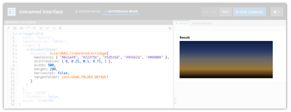
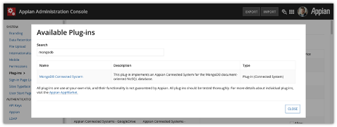

Introduction
============
This plugin provides an Expression Function called ``linearGradientImage()`` for generating simple, linear gradient PNG images based on the colors, distribution ratios, and dimensions you specify.

As seen above, the function returns an Appian ``Document`` data type which can be used in places such as an ``a!documentImage()`` or even linked to.

The genesis for this plugin was to provide gradient color backgrounds for a `Billboard Layout <https://docs.appian.com/suite/help/latest/Billboard_Layout.html>`_ component’s ``backgroundMedia`` value. A companion Appian Application is distributed with the plugin that includes Expression Rules and Interfaces for easy configuration of Billboard Layouts using this plugin.

Note that this companion application requires the `Color Picker Component <https://community.appian.com/b/appmarket/posts/color-picker-component-plug-in>`_ plugin.

Performance
-----------

To ensure high performance, the function will cache the generated images in Appian’s document management system and return existing images on subsequent calls (based on a file naming convention) rather than generating the same image over and over.

Initial image generation usually takes 100 - 200 milliseconds, and subsequent calls that return the existing images usually take less than 10 milliseconds.

You may wish to generate the image in a lower environment (e.g. DEV) and copy/move the image into your application as well, however the speed at which the plugin returns existing images is comparable to directly referencing an image using a Constant.

Compatibility
-------------
This plugin and its companion application were built and tested on Appian version 20.2.

Installation
------------
If installing to a fully-managed Appian Cloud instance, install using the `Plugins <https://docs.appian.com/suite/help/latest/Appian_Administration_Console.html#plug-ins>`_ panel of the `Administration Console <https://docs.appian.com/suite/help/latest/Appian_Administration_Console.html>`_.

If installing to a self-managed Appian instance, copy the ``GradientImageGenerator-1.0.jar`` plugin JAR file to the ``<APPIAN_HOME>/_admin/plugins`` directory.

Import the companion ``Generate Gradient Image Companion App 1.0.zip`` application as normal in your Appian instance.
